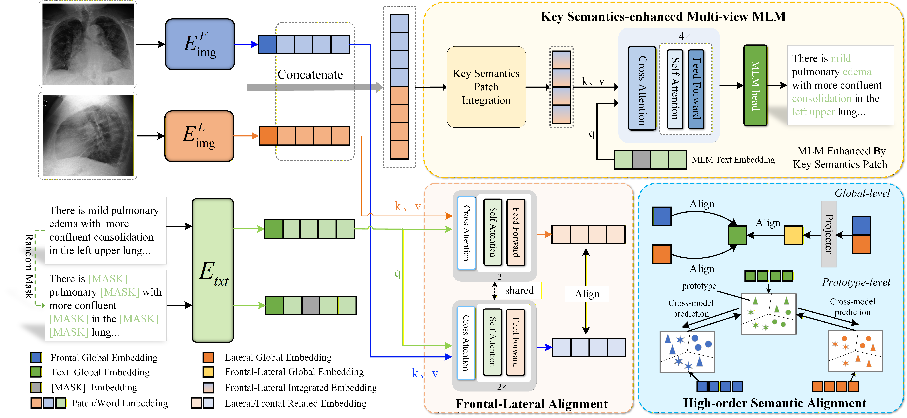

# Multi-view Chest X-Ray Vision-Language Pre-training via Semantic-Aware Masked Language Modeling and High-order Alignment
Chest X-Ray Vision-Language pretraining (VLP) leverages large-scale radiograph-report pairs to develop joint image-text representations, demonstrating significant potential for medical image diagnosis. 
However, existing VLP approaches often overlook the multi-view nature of chest X-Rays, and some multi-view methods apply uniform feature fusion, neglecting view-key semantic contributions. Moreover, random cross-modal Masked Language Modeling (MLM) fails to facilitate effective interactions, impeding representation alignment. 
Additionally, global alignment in VLP may lead to the false-negative problem. To address these limitations, we propose a novel medical VLP framework comprising three core components. First, a Key Semantics-enhanced Multi-view MLM module aggregates pathology-relevant patches across views, providing semantically rich supervision for MLM. 
A local semantics enhancing approach, which identifies and aggregates pathology-relevant key patches across views to guide MLM. Second, a Frontal-Lateral Alignment module extracts view-specific pathological features, ensuring semantic consistency and preserving critical information during aggregation. 
This module independently extracts pathological features from both views to preserve view-specific information while ensuring semantic consistency, which mitigates the loss of crucial information during aggregation. Third, a High-order Semantic Alignment approach mitigates false-negative issues by aligning features with semantically consistent clusters, enhancing global alignment through prototype-level semantics. 
Extensive experiments across seven public datasets demonstrate that our framework outperforms state-of-the-art methods in four downstream tasks, validating its efficacy.



## Installation
We used Python 3.8.20 with pytorch 2.0.0 

To clone this repository:
```shell
git clone https://github.com/sajiutea/F-L.git
```

To install Python requirements:
```shell
pip install -r requirements.txt
```

## Links to download datasets

- [MIMIC-CXR-JPG](https://physionet.org/content/mimic-cxr-jpg/2.0.0/)

- [NIH ChestX-ray](https://nihcc.app.box.com/v/ChestXray-NIHCC/folder/36938765345)

- [CheXpert](https://stanfordmlgroup.github.io/competitions/chexpert/#:~:text=What%20is%20CheXpert%3F,labeled%20reference%20standard%20evaluation%20sets.)

- [RSNA Pneumonia](https://www.kaggle.com/competitions/rsna-pneumonia-detection-challenge)

- [COVIDx CXR-3](https://www.kaggle.com/datasets/andyczhao/covidx-cxr2/versions/7)

- [SIIM-ACR Pneumothorax](https://www.kaggle.com/c/siim-acr-pneumothorax-segmentation)


## Training 
Train the model with the following command:

```bash
cd F-L
bash run.sh
```
## Acknowledgement
This work is built upon the [MGCA](https://github.com/fuying-wang/MGCA) and [LIMITR](https://github.com/gefend/LIMITR).
